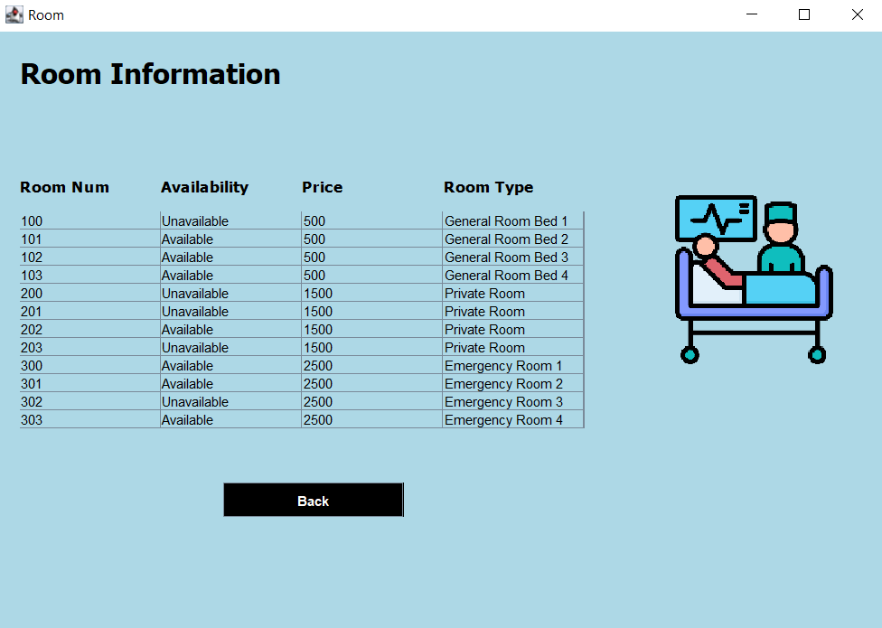

# Hospital Management System

A desktop-based Hospital Management System built entirely in **Java Swing**. The system uses **MySQL** as its database and connects through **JDBC**.

This project provides an intuitive interface for hospital staff to manage patients with full CRUD capabilities and billing features, while also enabling them to efficiently view and manage employees, departments, and rooms.

---

## Features

- **Login System**: Secure login for authorized personnel.
- **Patient Management**:
  - Add new patients
  - Update and delete patient records
  - View all patient data
- **Employee, Department & Room Information**:
  - View all hospital employees
  - List available departments and rooms
- **Billing System**:
  - Patients pay an initial **deposit** upon admission
  - **Checkout** feature calculates and collects the remaining balance before discharge

---

## Technologies Used

- **Java Swing** – GUI designed manually using code (no GUI builder)
- **JDBC** – For MySQL database connectivity
- **MySQL Workbench** – Backend database

---

## External Libraries

Located in the `libs/` folder:

- `mysql-connector-java-8.0.26.jar` – JDBC driver for MySQL
- `ResultSetXml.jar` – Contains `DbUtils` for converting `ResultSet` to `TableModel`
The project uses `DbUtils` (from `ResultSetXml.jar`) to simplify the process of populating `JTable` components directly from SQL queries

---

## System Screenshots

> All images are stored in `Hospital-Management-System/src/screens`

### Login Screen

### Reception Interface

### New Patient

### Patient List

### Rooms

### Departments

### Employees

### Update Patient Info

### Checkout

---

## Project Structure

- `src/`: Source code folder.
- `src/screens/` – Java classes for GUI screens
- `src/icon/`: containing project icons
- `database/`: containing database-related files.
- `libs/`: Libraries folder (`mysql-connector-java-8.0.26.jar`, `ResultSetXml.jar`).

---

## How to Run

1. Clone or download this repository.
2. Import the provided .sql file from the database/ folder into MySQL Workbench to set up the database.
3. Add the libraries found in the libs/ folder to your classpath.
4. Configure the JDBC connection string in the code to connect to your database.
5. Run the project from your preferred IDE (IntelliJ, NetBeans, Eclipse, etc..).

